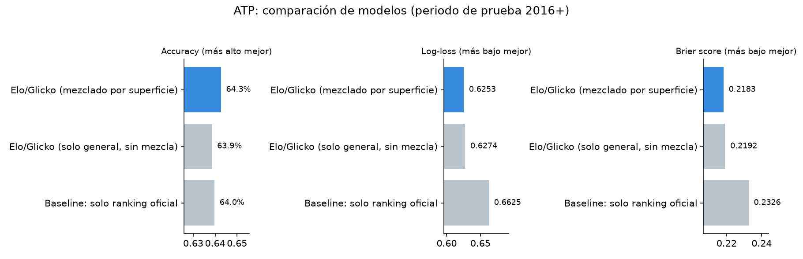
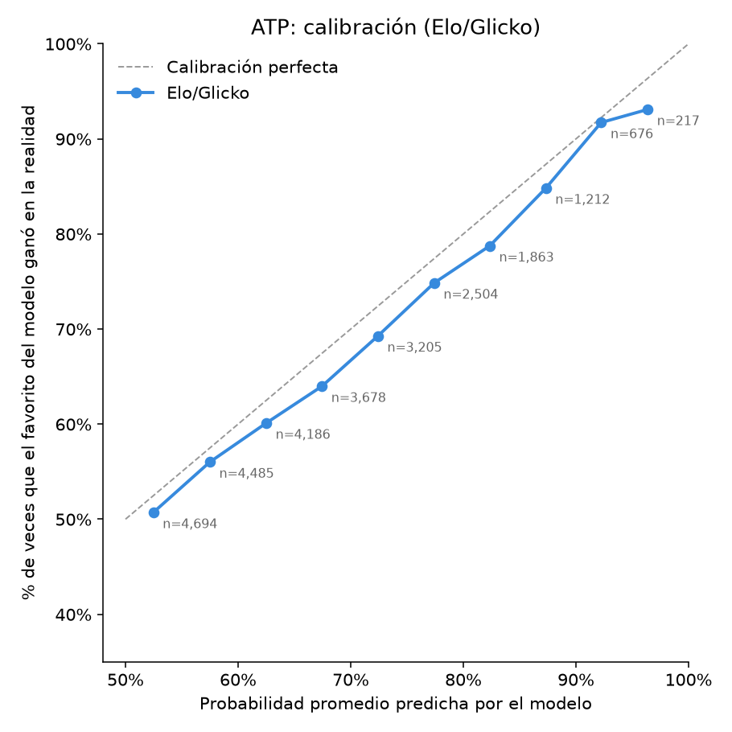
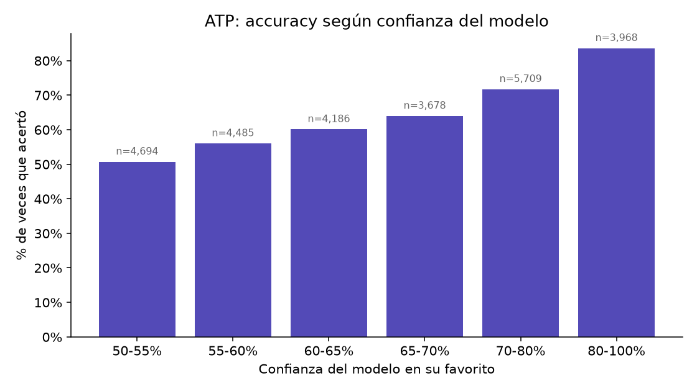
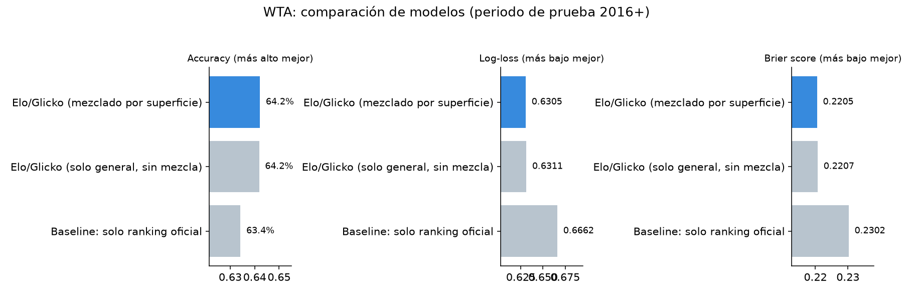
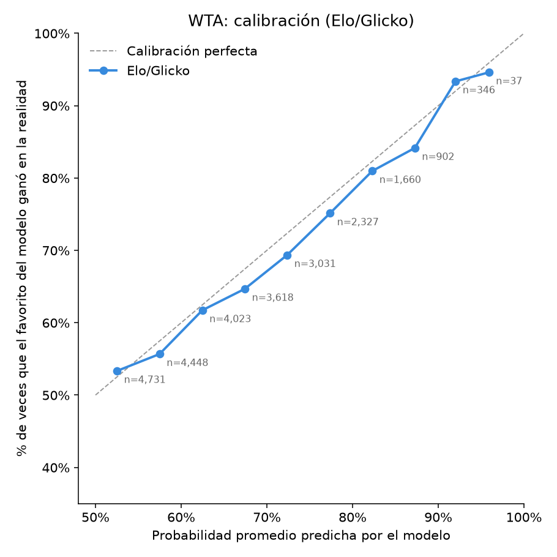
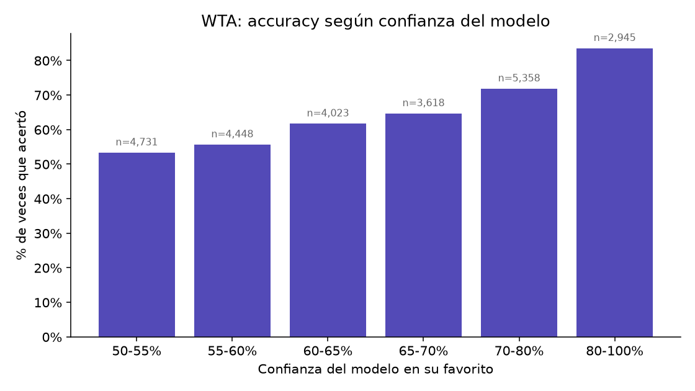

# Reporte de validación (backtesting)

Etapa 1 · Actividad 4 — periodo de prueba: 2016–2026

## ATP

Periodo de prueba: 2016–2026 (26,720 partidos Elo/Glicko, 26,643 con ranking para el baseline).

| Modelo | Accuracy | Log-loss | Brier |
|---|---|---|---|

| Elo/Glicko (mezclado por superficie) | 64.3% | 0.6253 | 0.2183 |

| Elo/Glicko (solo general, sin mezcla) | 63.9% | 0.6274 | 0.2192 |

| Baseline: solo ranking oficial | 64.0% | 0.6625 | 0.2326 |

- Elo/Glicko acierta 64.3% de los partidos vs. 64.0% del baseline de solo-ranking — una mejora de 0.3 puntos porcentuales.

- La mezcla por superficie aporta 0.41 puntos porcentuales de accuracy frente a usar solo el rating general (aporta algo real).

- 34.4% de los partidos son 'volados' para el modelo (confianza <60%) — ahí ningún modelo debería esperar hacerlo mucho mejor que adivinar.

- En los partidos donde el modelo sí tiene confianza (≥70%), acierta el 76.6% de las veces. El 64.3% agregado es el promedio de estos dos mundos, no un reflejo parejo de qué tan útil es el modelo.

**Por superficie (Elo/Glicko, periodo de prueba):**

| Superficie | n | Accuracy | Log-loss | Brier |
|---|---|---|---|---|

| Hard | 15,571 | 64.7% | 0.6217 | 0.2165 |

| Clay | 8,313 | 63.4% | 0.6367 | 0.2236 |

| Grass | 2,836 | 64.6% | 0.6117 | 0.2127 |

## WTA

Periodo de prueba: 2016–2026 (25,123 partidos Elo/Glicko, 24,994 con ranking para el baseline).

| Modelo | Accuracy | Log-loss | Brier |
|---|---|---|---|

| Elo/Glicko (mezclado por superficie) | 64.2% | 0.6305 | 0.2205 |

| Elo/Glicko (solo general, sin mezcla) | 64.2% | 0.6311 | 0.2207 |

| Baseline: solo ranking oficial | 63.4% | 0.6662 | 0.2302 |

- Elo/Glicko acierta 64.2% de los partidos vs. 63.4% del baseline de solo-ranking — una mejora de 0.8 puntos porcentuales.

- La mezcla por superficie aporta 0.03 puntos porcentuales de accuracy frente a usar solo el rating general (aporta algo real).

- 36.5% de los partidos son 'volados' para el modelo (confianza <60%) — ahí ningún modelo debería esperar hacerlo mucho mejor que adivinar.

- En los partidos donde el modelo sí tiene confianza (≥70%), acierta el 76.0% de las veces. El 64.2% agregado es el promedio de estos dos mundos, no un reflejo parejo de qué tan útil es el modelo.

**Por superficie (Elo/Glicko, periodo de prueba):**

| Superficie | n | Accuracy | Log-loss | Brier |
|---|---|---|---|---|

| Hard | 15,614 | 64.6% | 0.6282 | 0.2195 |

| Clay | 6,779 | 63.3% | 0.6345 | 0.2225 |

| Grass | 2,730 | 64.4% | 0.6333 | 0.2215 |
